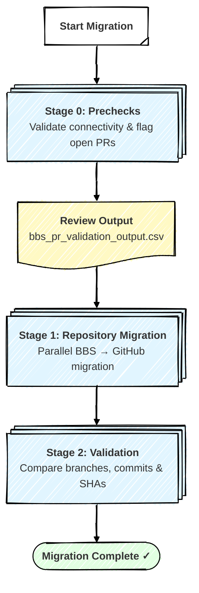

# 🚀 Bitbucket Server to GitHub Repository Migration Pipeline

[](https://opensource.org/licenses/MIT)
[](https://github.com/github/gh-bbs2gh)
[](https://github.com/github/gh-bbs2gh)

> A GitHub Actions–based solution for migrating **Bitbucket Server** repositories to **GitHub** at scale. Supports parallel migrations, pre-migration checks, post-migration validation, multiple storage backends, and GitHub Data Residency.

---

## 🎯 Migration Challenges at Enterprise Scale

Migrating repositories from Bitbucket Server to GitHub is a multi-stage process that includes readiness validation, parallel repository migration, and post-migration verification. When applied across hundreds or thousands of repositories, this process becomes difficult to coordinate, error-prone, and hard to scale using ad-hoc commands.

This toolkit addresses those challenges through a staged, CSV-driven execution model. Each stage runs independently, produces machine-readable output, and can be executed from the command line or embedded inside a CI/CD pipeline. Failures in individual repositories are isolated — they do not block the remaining batch.

At enterprise scale, this toolkit overcomes the following challenges:

- ⏱️ Serial migration does not scale for large repository inventories
- ⚠️ Open pull requests are silently dropped without advance readiness checks
- 🔍 Manual post-migration verification leads to missed discrepancies
- 📊 Tracking partial success and failures across large batches is operationally complex
- 🌍 Data Residency requirements demand routing migrations through regional API endpoints

---

## 📋 Table of Contents

- [Pipeline Execution Model](#-pipeline-execution-model)
- [Limitations](#️-limitations)
- [Prerequisites](#️-prerequisites)
- [Initial Setup](#-initial-setup)
- [Quick Start](#-quick-start)
- [Migration Complete](#-migration-complete)

---

## 📋 Pipeline Execution Model

> ℹ️ **Informational Only**  
> This section is provided for **conceptual understanding** of the migration flow.  
> Actual execution behavior is governed by the script implementations.

This toolkit orchestrates a **three-stage sequential migration process** from Bitbucket Server / Data Center to GitHub. Each stage can be run from the command line (Bash or PowerShell) or embedded in an Azure DevOps pipeline using the YAML definition in `samples/`.

### Key Features

- **Parallel Migration:** Stage 1 runs up to `--max-concurrent` migrations simultaneously (default: 3, max: 20), with a live `QUEUED / IN PROGRESS / MIGRATED / FAILED` status bar.

- **Isolated Failures:** Each repository migration is independent. A failure in one repository does not affect others in the same batch.

- **Storage Auto-Detection:** Stage 1 automatically selects the correct storage backend — AWS S3, Azure Blob Storage, or GitHub-owned — based on the environment variables present.

- **Data Residency Support:** All migration commands can be routed through a regional GitHub API endpoint via `--target-api-url` or the `TARGET_API_URL` environment variable.

- **Cross-Platform:** All scripts have Bash (`scripts/`) and PowerShell (`misc/`) equivalents so the same workflow runs on Linux, macOS, and Windows.

> **Note:** Since each stage produces a timestamped output CSV, you can review results between stages before advancing.



### Stage Execution Details

Each stage executes a specific script and generates a timestamped output file. Review each output before advancing to the next stage.

### Stage 0️⃣: Prechecks (`0_prechecks.sh`)
Executes a readiness check against the Bitbucket REST API to:

- Authenticate against Bitbucket using PAT or Basic credentials
- Read repository scope from `repos.csv` or auto-discover all projects and repositories
- Check each repository for **open pull requests** and flag them as warnings
- Produce `bbs_pr_validation_output-<timestamp>.csv` with per-repository readiness status

> **⚠️ IMPORTANT**: Open PRs will **not** be migrated. Close or merge all open PRs before proceeding to Stage 1 to avoid data loss.

### Stage 1️⃣: Repository Migration (`1_migration.sh`)
Executes parallel BBS → GitHub migrations to:

- Read source/target mappings from `repos.csv`
- Run up to `--max-concurrent` migrations in parallel using `gh bbs2gh migrate-repo`
- Auto-detect the storage backend (AWS S3, Azure Blob, or GitHub-owned)
- Display a live status bar: `QUEUED / IN PROGRESS / MIGRATED / FAILED`
- Write `repo_migration_output-<timestamp>.csv` tracking the final status of each repository

### Stage 2️⃣: Validation (`2_validation.sh`)
Executes post-migration validation (against successfully migrated repos only) to:

- Compare branch names between Bitbucket and GitHub
- Verify commit counts match for each branch
- Validate latest commit SHAs to confirm complete history transfer
- Produce three output artifacts:
  - `validation-log-<timestamp>.txt` — full verbose log
  - `validation-summary.csv` — machine-readable per-repository results
  - `validation-summary.md` — human-readable Markdown report

---

## ⚠️ Limitations

#### 1️⃣ What Gets Migrated
- Git repository content (all files)
- Complete commit history
- All branches and tags
- Commit metadata (authors, dates, messages, SHAs)

**Not migrated:** Open pull requests, Bitbucket pipeline definitions, webhooks, or access permissions.

**Recommendation:** Complete or abandon all active pull requests before migrating.

#### 2️⃣ Maximum Concurrency
- The migration stage enforces a hard cap of **20 concurrent migrations** per run.
- The default concurrency is **3**. Increase with `--max-concurrent` up to the limit.
- The actual repository migration runs on **GitHub's backend services**, not on the local machine. The script only polls migration status at regular intervals.

- **Track Long-Running Migrations:**
If a migration is taking longer than expected, monitor progress directly using the GitHub CLI:

```bash
gh extension install mona-actions/gh-migration-monitor
gh migration monitor
```

[GitHub Migration Monitor](https://github.com/mona-actions/gh-migration-monitor)

#### 3️⃣ SSH Key Requirement
- The SSH private key used for migration must be **unencrypted** (no passphrase).
- Provide the key via `SSH_PRIVATE_KEY_PATH` (path to a file) or `SSH_PRIVATE_KEY` (raw PEM content).

#### 4️⃣ Storage Backend Exclusivity
AWS S3 and Azure Blob Storage **cannot be configured simultaneously**. Configure exactly one, or neither to fall back to GitHub-owned storage.

| Backend | Required Variables |
|---------|--------------------|
| AWS S3 | `AWS_ACCESS_KEY_ID`, `AWS_SECRET_ACCESS_KEY`, `AWS_BUCKET_NAME`, `AWS_REGION` |
| Azure Blob | `AZURE_STORAGE_CONNECTION_STRING` |
| GitHub-owned | _(no variables needed — automatic fallback)_ |

#### 5️⃣ Bitbucket Cloud Not Supported
This toolkit targets **Bitbucket Server and Data Center** only. For Bitbucket Cloud migrations, use the Bitbucket Cloud path of the `gh bbs2gh` extension.

---

## ⚙️ Prerequisites

### Required Tools

| Tool | Purpose | Installation |
|------|---------|-------------|
| **GitHub CLI** (`gh`) | Core migration engine | [cli.github.com](https://cli.github.com) |
| `gh bbs2gh` extension | BBS migration extension | `gh extension install github/gh-bbs2gh` |
| **`jq`** | JSON parsing in Bash scripts | `apt install jq` / `brew install jq` |
| **`curl`** | Bitbucket REST API calls | Pre-installed on most systems |
| **`python3`** | URL encoding in validation script | Pre-installed on most systems |

> **Windows users:** PowerShell equivalents are available in `misc/`. PowerShell 7+ (`pwsh`) is recommended.

### Required Access

- **GitHub PAT** with `repo`, `admin:org`, and `workflow` scopes — stored as `GH_PAT`.
- **Bitbucket Server credentials** — either a PAT (`BBS_PAT`, recommended) or username/password with `BBS_AUTH_TYPE=Basic`.
- **SSH access** to the Bitbucket Server host with a passphrase-free private key.

---

## 🔧 Initial Setup

Complete these steps before your first migration run:

#### 1️⃣ 🔐 Authenticate the GitHub CLI

```bash
gh auth login
# or export the token directly:
export GH_PAT=<your-github-pat>
```

---

#### 2️⃣ 🧩 Install the BBS2GH Extension

```bash
gh extension install github/gh-bbs2gh
```

Verify the installation:

```bash
gh bbs2gh --version
```

---

#### 3️⃣ 🌍 Configure Environment Variables

Set the following environment variables before running any script. See `bbs2gh-env-list.txt` for the complete reference.

**Required for all stages:**

```bash
export GH_PAT=<github-personal-access-token>
export BBS_BASE_URL=http://bitbucket.example.com:7990
export SSH_USER=<ssh-username>
export SSH_PRIVATE_KEY="$(cat ~/.ssh/id_rsa)"   # must be passphrase-free
```

**Bitbucket authentication (choose one):**

```bash
# Option A — PAT (recommended)
export BBS_PAT=<bitbucket-personal-access-token>

# Option B — Basic auth
export BBS_AUTH_TYPE=Basic
export BBS_USERNAME=<bitbucket-username>
export BBS_PASSWORD=<bitbucket-password>
```

**Storage backend (choose one, or omit for GitHub-owned storage):**

```bash
# AWS S3
export AWS_ACCESS_KEY_ID=...
export AWS_SECRET_ACCESS_KEY=...
export AWS_BUCKET_NAME=...
export AWS_REGION=...

# Azure Blob Storage
export AZURE_STORAGE_CONNECTION_STRING=...
```

**Data Residency (optional):**

```bash
export TARGET_API_URL=https://api.tenant.ghe.com   # regional API endpoint
```

---

#### 4️⃣ 🗂️ Prepare `repos.csv`

Edit `repos.csv` to define the repositories to migrate. The required columns are:

| Column | Description |
|--------|-------------|
| `project-key` | Bitbucket project key (e.g., `MYPROJ`) |
| `project-name` | Bitbucket project display name |
| `repo` | Bitbucket repository slug |
| `github_org` | Target GitHub organization |
| `github_repo` | Target GitHub repository name |
| `gh_repo_visibility` | `private`, `internal`, or `public` |

**Example `repos.csv`:**
```csv
project-key,project-name,repo,github_org,github_repo,gh_repo_visibility
MYPROJ,My Project,my-repo,my-github-org,my-repo-migrated,private
PLATFORM,Platform Team,api-service,my-github-org,platform-api,private
```

> **💡 Tip:** For a first run, start with one or two non-critical repositories to validate your environment before migrating the full inventory.

---

## 🚀 Quick Start

**Before you begin**, ensure you've completed the [Initial Setup](#-initial-setup):
- ✅ GitHub CLI authenticated and `gh bbs2gh` extension installed
- ✅ All required environment variables exported
- ✅ `repos.csv` prepared with at least one repository

---

#### 1️⃣ **Make scripts executable** (Linux / macOS)
```bash
chmod +x scripts/*.sh
```

#### 2️⃣ **Run Stage 0 — Prechecks**
```bash
./scripts/0_prechecks.sh -c repos.csv
```

Review the output report and resolve any flagged open PRs before continuing:

| Stage | Output File | What to Check |
|-------|-------------|---------------|
| **Stage 0: Prechecks** | `bbs_pr_validation_output-<timestamp>.csv` | ✅ No `OPEN_PRS` warnings remain |

#### 3️⃣ **Run Stage 1 — Migration**
```bash
./scripts/1_migration.sh --csv repos.csv --max-concurrent 5
```

Monitor the live status bar and verify the output:

| Stage | Output File | What to Check |
|-------|-------------|---------------|
| **Stage 1: Migration** | `repo_migration_output-<timestamp>.csv` | ✅ All repositories show `MIGRATED` |

#### 4️⃣ **Run Stage 2 — Validation**
```bash
./scripts/2_validation.sh -c repos.csv
```

Review the validation report:

| Stage | Output File | What to Check |
|-------|-------------|---------------|
| **Stage 2: Validation** | `validation-summary.md` | ✅ All entries show `✅ Matching` for branches, commits, and SHAs |

---

### Windows (PowerShell)

```powershell
# Stage 0 — Prechecks
pwsh misc/0_prechecks.ps1 -c repos.csv

# Stage 1 — Migration
pwsh misc/1_migration.ps1 --csv repos.csv --max-concurrent 5

# Stage 2 — Validation
pwsh misc/2_validation.ps1 -c repos.csv
```

### Azure Pipelines

A ready-to-use pipeline definition is available at `samples/ado2gh-migration.yml`. Configure a variable group named `core-entauto-github-migration-secrets` containing your `GH_PAT` and Bitbucket credentials, then import the YAML into your Azure DevOps project.

---

## 🎉 Migration Complete!

After all three stages complete successfully, confirm the following checklist before decommissioning Bitbucket repositories.

### Checklist

- [ ] **Stage 0 output** — No `OPEN_PRS` warnings remain (or you have acknowledged the loss of open PRs).
- [ ] **Stage 1 output** — All repositories in `repo_migration_output-<timestamp>.csv` show `MIGRATED`.
- [ ] **Stage 2 output** — All entries in `validation-summary.md` show `✅ Matching` for branches, commit counts, and latest SHAs.
- [ ] **GitHub repository settings** — Confirm visibility, branch protection rules, and team access are correctly configured.
- [ ] **CI/CD pipelines** — Update pipeline configurations to point to the new GitHub repository URLs.
- [ ] **Webhooks and integrations** — Reconfigure Bitbucket webhooks, Jira integrations, or any notification services.
- [ ] **Developer workstations** — Notify developers of the new remote URLs and provide instructions to update local clones:

  ```bash
  git remote set-url origin https://github.com/<org>/<repo>.git
  ```

### Output Artifacts Reference

| File | Stage | Description |
|------|-------|-------------|
| `bbs_pr_validation_output-<timestamp>.csv` | 0 | Per-repository open PR counts and migration readiness |
| `repo_migration_output-<timestamp>.csv` | 1 | Per-repository migration status (`MIGRATED` / `FAILED`) |
| `validation-log-<timestamp>.txt` | 2 | Full verbose validation log |
| `validation-summary.csv` | 2 | Machine-readable per-repository validation results |
| `validation-summary.md` | 2 | Human-readable Markdown validation report |

**Next Steps:**
- **More repositories?** Update `repos.csv` and rerun the pipeline from Stage 0
- **Partial failures?** Fix the root cause, remove successfully migrated repos from `repos.csv`, and rerun Stage 1 for remaining repos

> **💡 Tip:** Once all checks pass and teams are working from GitHub, decommission or archive Bitbucket repositories following your organization's retention policy.
